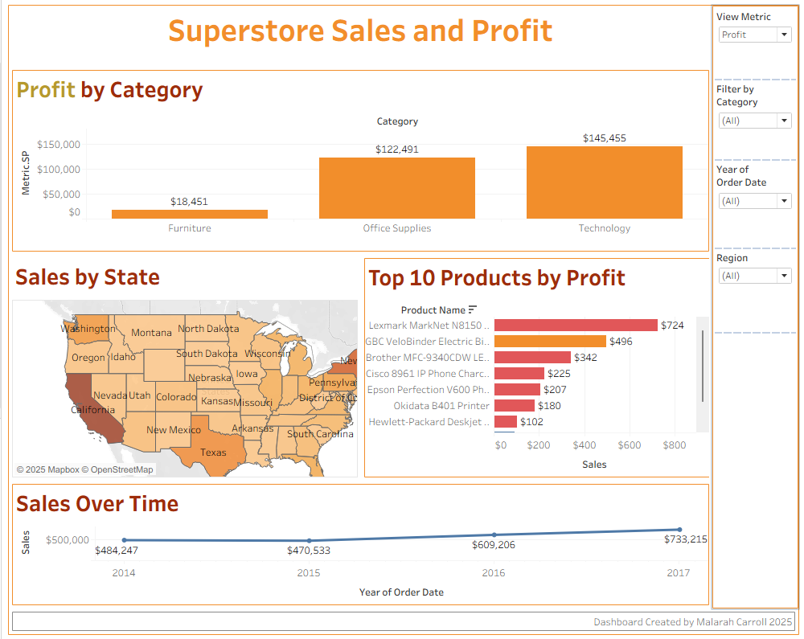

# Tableau_Superstore_Dashboard
Interactive Tableau dashboard analyzing Superstore sales and profit trends across categories, states, and time.
# Superstore Sales & Profit Dashboard

📊 **Project Type:** Tableau | Data Visualization | Business Analytics  
📅 **Created by:** Malarah Carroll | 2025  

## Overview
An interactive Tableau dashboard analyzing **sales and profit performance** across product categories, U.S. regions, and time periods.  
Includes dynamic metric switching (Sales ↔ Profit), filters, and parameter-driven visuals for deeper insights.

## Key Features
- 📈 Dynamic metric selection using Tableau parameters  
- 🗺 Regional sales map with color-coded performance  
- 💼 Category and product-level profitability insights  
- 🕒 Year-over-year trend analysis  
- 🧩 Interactive filters for Region, Category, and Year  

## Tools Used
- Tableau Public (Dashboard design & publishing)  
- Excel / CSV (Data source)  

## View the Interactive Dashboard
👉 **[Click here to open on Tableau Public](https://public.tableau.com/app/profile/malarah.carroll/viz/SuperstoreSalesandProfitDashboardTableauProject/Dashboard1?publish=yes)

## Snapshot

## About
This project is part of my data analytics and visualization portfolio.  
It demonstrates practical Tableau skills in **data storytelling, parameter control, and dashboard interactivity**.
